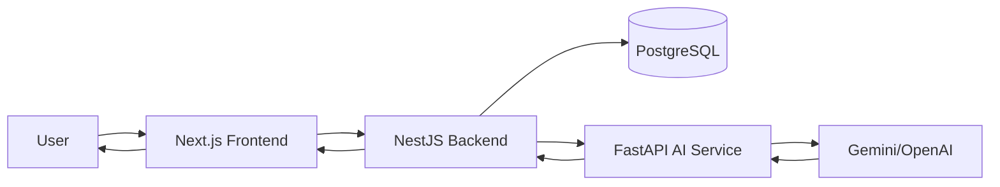
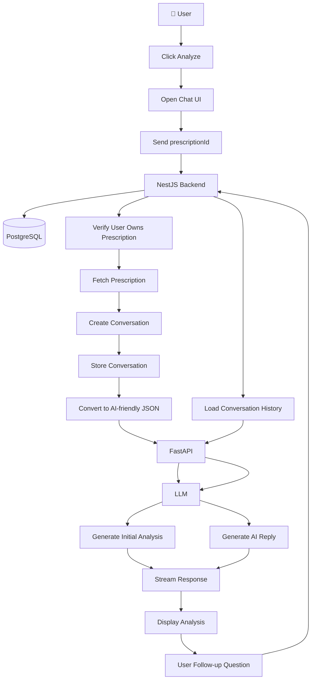
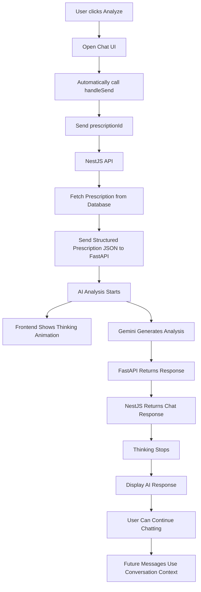
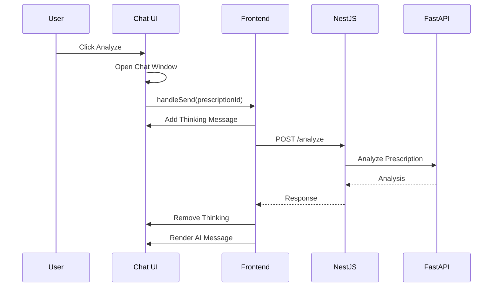
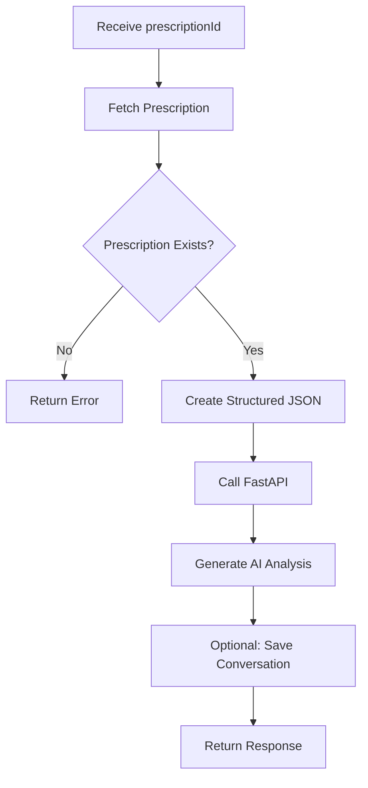
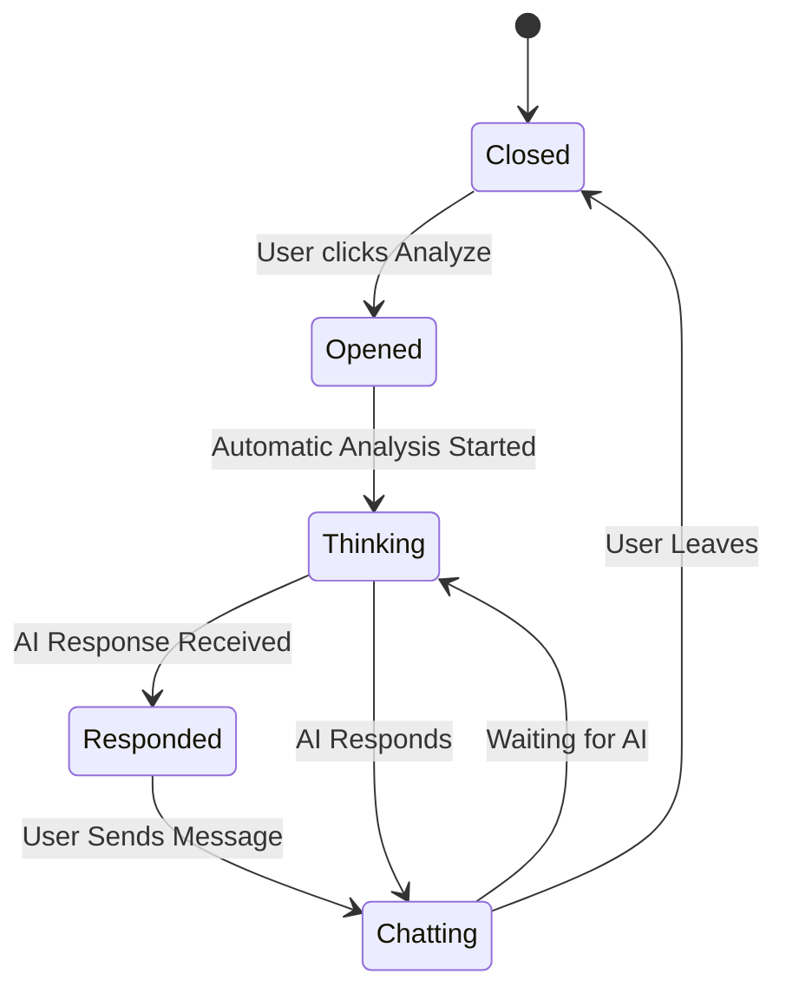
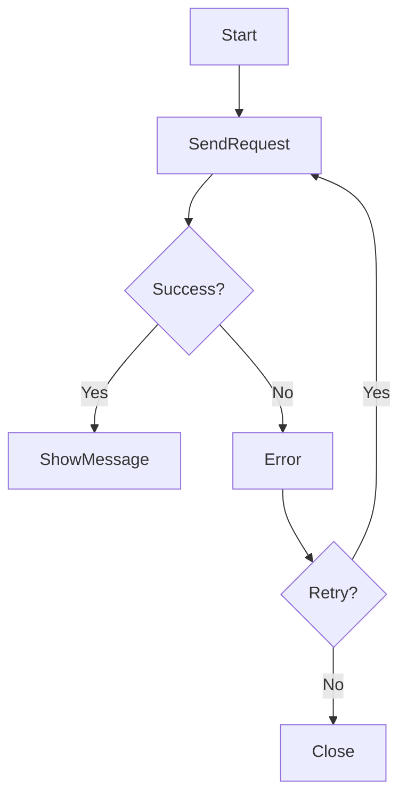

# Prescription Analyzer Assistant - Flow Design

## Overview

The Prescription Analyzer Assistant allows a patient to analyze any prescription and then continue chatting with an AI assistant.

The first interaction is **automatic**. Once the user clicks **Analyze**, the system fetches the prescription, sends it to the AI, displays a thinking state, and finally shows the analysis. After that, the chat behaves like a normal AI assistant with full conversation memory.

---

# High Level Architecture



---

# Architecture

---

# Complete User Flow



---

# Frontend Sequence



---

# Backend Flow



---

# Chat Lifecycle



---

# Thinking State

While FastAPI is processing:

- Disable input (optional)
- Show animated typing indicator
- Display text like:
  - "Analyzing your prescription..."
  - "Checking medicines..."
  - "Looking for interactions..."
  - "Preparing explanation..."

The thinking message is temporary and removed once the AI response arrives.

---

# Conversation States

| State | Description |
|---------|------------|
| idle | Chat not opened |
| initializing | Chat opened |
| sending | Sending prescriptionId |
| fetching | Backend fetching prescription |
| analyzing | AI generating response |
| thinking | Frontend showing loading |
| completed | First response shown |
| chatting | Normal AI conversation |
| error | Something failed |

---

# API Flow

## Initial Analysis

```
POST /analyze/prescription

Body

{
    "prescriptionId": "abc123"
}
```

### Backend

1. Fetch prescription
2. Convert to structured JSON
3. Send JSON to FastAPI
4. Receive analysis
5. Return response

Example response

```json
{
  "conversationId": "conv_123",
  "message": "This prescription contains..."
}
```

---

## Continue Chat

```
POST /chat/message

{
    "conversationId":"conv_123",
    "message":"Can I take this medicine after food?"
}
```

Backend forwards the message to FastAPI together with the conversation context.

---

# Message Flow

```text
User
│
├── Analyze Prescription
│
AI
│
├── Analyzing your prescription...
├── Looking at medications...
├── Checking interactions...
└── Done

↓

AI

"This prescription contains three medicines.

Medicine A is...

Medicine B is...

Possible side effects...

Recommendations..."
```

---

# Error Flow



---

# End-to-End Flow Summary

```mermaid
flowchart LR

ClickAnalyze

--> OpenChat

--> SendPrescriptionId

--> NestFetchPrescription

--> FastAPIAnalysis

--> AIModel

--> AnalysisGenerated

--> ResponseReturned

--> ShowResponse

--> ContinueChat

--> ConversationMemory

--> MoreQuestions
```



---

# Design Principles

- **Automatic first message:** The user doesn't need to type anything after clicking **Analyze**; the analysis starts immediately.
- **Responsive UI:** Open the chat instantly and show a thinking indicator while analysis is in progress.
- **Conversation continuity:** Reuse a `conversationId` so follow-up questions have context.
- **Backend separation:** NestJS handles authentication, authorization, data fetching, and orchestration; FastAPI focuses solely on AI reasoning.
- **Scalable architecture:** The same chat infrastructure can later support lab reports, medical history, imaging reports, and general health questions.